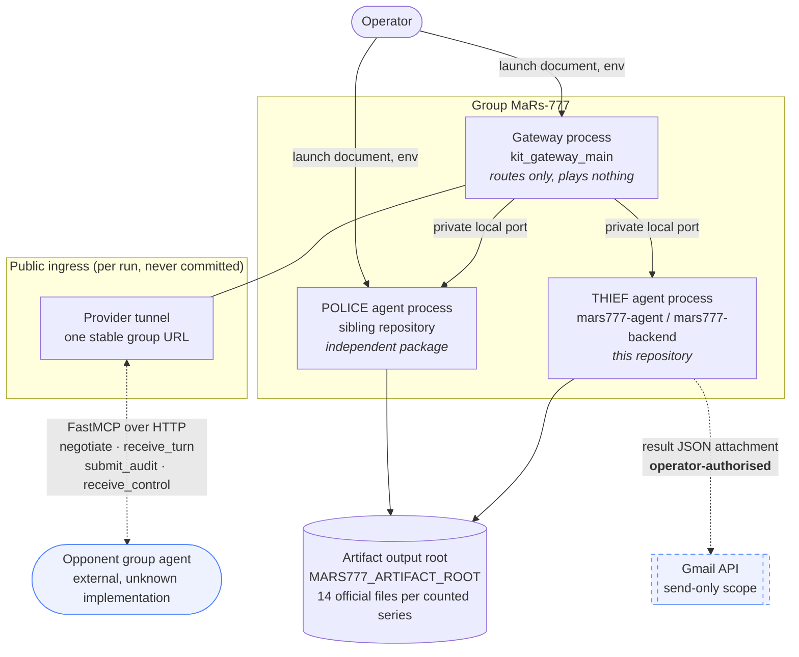
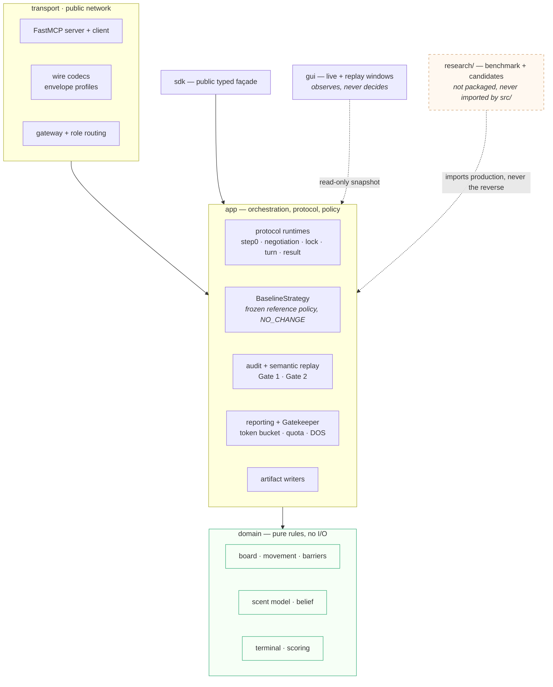
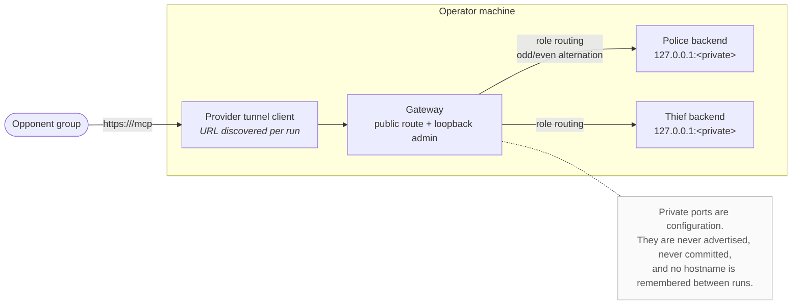

# Architecture diagrams — group MaRs-777

**Mermaid source, committed as text.** Diagrams live beside the code they
describe so they can be reviewed in a diff and corrected in a pull request. No
diagram tool is added to the runtime dependencies: GitHub, VS Code and most
Markdown viewers render these blocks directly, and nothing here needs a build
step.

**Every element below exists in this repository today.** No planned service, no
aspirational component, no box that is really a wish. Where something is
partner-dependent or operator-authorised it is drawn with a dashed edge and
labelled as such, so an unperformed step is never mistaken for a shipped one.

---

## 1. System / container view

One group, one public URL, two independent role processes. The Police and Thief
agents are **separate repositories and separate processes**; they never import
each other and never share state.



**Read the dashes.** The opponent edge is exercised against a pinned third-party
kit and against our own public loopback; a **counted** match against another
group's agent has not happened and is partner-dependent. The Gmail edge is
implemented and tested end to end against a fake transport, but **no live send
has been performed** — that needs explicit operator authorisation.

---

## 2. Application component view

Dependencies point inward only. `domain` knows nothing of `app`; `app` reaches
outward exclusively through ports; `research` is evidence and is **not** part of
the distributed package.



The two dashed edges are the ones a reviewer should check: the GUI may **read** a
turn snapshot and may never decide anything, and `research` depends on production
while production never depends on `research` — asserted by a test that parses
every production module's imports.

**This repository ships no barrier policy.** `BAR-004` gives placement to the
police alone, so the thief's strategy is movement only; the competitive research
that produced the police barrier rule is recorded in the police repository and is
not restated here as though it were this agent's work.

---

## 3. Counted sub-game sequence

One lawful sub-game, from config negotiation to a report that is ready to send.
Both sides seal before either reveals; that ordering is what the audit checks.

```mermaid
sequenceDiagram
    autonumber
    participant P as Thief agent
    participant T as Opponent agent
    participant A as Audit + semantic replay
    participant R as Artifacts / report

    Note over P,T: Step-0 — identity, capability inventory, keyed proof
    P->>T: negotiate(step0 inventory + HMAC proof)
    T-->>P: step0 inventory + proof
    Note over P,T: both verify; a failed proof is E-AUTH-FAILURE, no fallback

    P->>T: negotiate(config proposal)
    T-->>P: config proposal / acceptance
    P->>T: negotiate(config lock + config_sha256)
    T-->>P: lock evidence
    Note over P,T: CONFIG_LOCKED — 35 members, digest agreed both ways

    loop each step until a terminal
        P->>P: Observation → strategy → action
        P->>T: receive_turn(commitment = H(payload ‖ nonce))
        T-->>P: acknowledgement
        P->>T: receive_turn(reveal: move, hint, scent emission)
        T-->>P: reveal
        Note over P,T: sealed before revealed — neither saw the other's step
        P->>P: adopt peer barrier effects, answer capture truthfully
    end

    P->>T: submit_audit(final nonce reveal)
    T-->>P: final nonce reveal
    P->>A: disclosed transcript + config + nonces
    A-->>P: Gate 1 commitments VERIFIED
    A-->>P: Gate 2 semantic verdict CONSISTENT
    P->>T: receive_control(result agreement + result_sha256)
    T-->>P: digest response
    P->>R: 14 official artifacts written
    R-->>P: result_<game_id>.json ready
    Note over R: Gmail send is operator-authorised and has not been performed
```

---

## 4. Deployment / public ingress

**One public URL for the group, not one per role.** The gateway is the only
thing the partner addresses; role selection happens behind it.



---

## Keeping these true

Each diagram names real modules (`kit_gateway_main`, `BaselineStrategy`,
`semantic_replay`) and real tool names (`negotiate`, `receive_turn`,
`submit_audit`, `receive_control`). If one of those disappears, the diagram is
wrong and should fail review — that is the reason for naming them rather than
drawing generic boxes.
